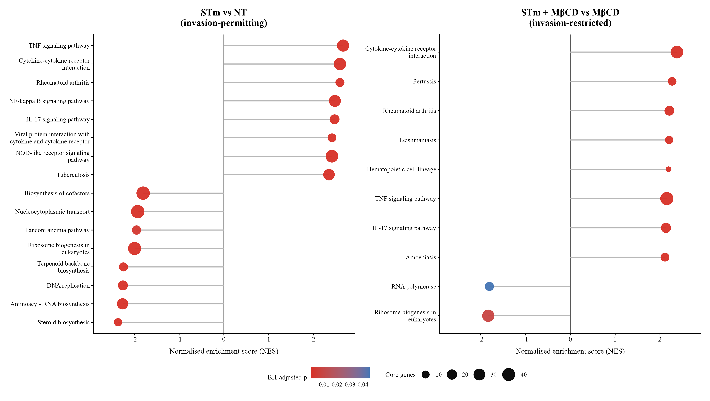

# Bulk RNA-seq analysis of Salmonella-infected *Apc*<sup>min/+</sup> tumour organoids

Analysis code accompanying the MSci placement report:

**Characterisation of host inflammatory responses to intracellular and extracellular attenuated *Salmonella* Typhimurium in *Apc*<sup>min/+</sup> tumour organoids**

University of Glasgow | Cancer Research UK Scotland Institute, 2026

## Overview

This repository analyses bulk RNA-seq data from murine *Apc*<sup>min/+</sup> intestinal tumour organoids exposed to attenuated *Salmonella* Typhimurium (STmΔaroA), with or without methyl-β-cyclodextrin (MβCD). The four conditions are non-treated (NT), MβCD-treated, STm, and STm+MβCD.

## Corrected and frozen GSEA analysis

The final thesis GSEA workflow is provided in [`analysis/GSEA_Mouse_fixed.R`](analysis/GSEA_Mouse_fixed.R). This supersedes the exploratory GSEA cells in `Salmonella_Mouse.ipynb` for Figure 1C-D.

The corrected workflow:

- retains genes with at least 10 reads in at least three samples before DESeq2 analysis;
- uses the contrasts STm vs NT and STm+MβCD vs MβCD;
- ranks genes by the unshrunk DESeq2 log2 fold change;
- maps mouse Ensembl identifiers to Entrez identifiers using `org.Mm.eg.db`;
- tests KEGG gene sets containing 10–500 genes;
- uses Benjamini–Hochberg-adjusted `p < 0.05` as the final retention criterion;
- includes both positive and negative normalised enrichment scores (NES);
- fixes the random seed, KEGG mapping, software versions and serial execution mode;
- validates the expected pathway counts before completing.

The frozen results are:

| Comparison | Positive NES | Negative NES | Total |
|---|---:|---:|---:|
| STm vs NT | 73 | 16 | 89 |
| STm+MβCD vs MβCD | 29 | 2 | 31 |

These values and the corresponding result tables and figures were produced in the same analysis run.

## Repository contents

- `Salmonella_Mouse.ipynb` — original exploratory R notebook
- `analysis/GSEA_Mouse_fixed.R` — corrected, frozen GSEA workflow used for the final thesis
- `results/` — complete and adjusted-p-value-filtered GSEA tables
- `figures/` — Figure 1C-D GSEA panels and combined preview
- `reference/` — dated KEGG mouse pathway mapping and provenance note
- `environment/` — R session information, analysis manifest and file checksums

## Input data

The analysis requires `coldata_ms.csv`, containing the count matrix used by the notebook. The data were generated by G. Mackie and are not distributed in this repository.

The expected input SHA-256 is:

```text
321094EC6746329BB2721E0626C84F7446B580136427A4B441B0553514C694EB
```

The script also checks the expected 12 sample columns before running. Place the file at `data/coldata_ms.csv`, or pass its path explicitly:

```bash
Rscript analysis/GSEA_Mouse_fixed.R /path/to/coldata_ms.csv
```

## Frozen environment

The validated run used:

- R 4.5.2
- DESeq2 1.50.2
- clusterProfiler 4.18.4
- fgsea 1.36.2
- org.Mm.eg.db 3.22.0
- AnnotationDbi 1.72.0
- KEGGREST 1.50.0
- ggplot2 4.0.3

The complete package listing is available in [`environment/sessionInfo.txt`](environment/sessionInfo.txt).
File-level checksums are recorded in [`environment/SHA256SUMS.txt`](environment/SHA256SUMS.txt). The frozen KEGG snapshot SHA-256 is `F3C657A170165F06B7E1F88A3A848EE5B1CC8A8109A986F4D7896EB56421DAE2`.

## Figure preview



## KEGG attribution

The pathway mapping was retrieved through the KEGG API for this academic analysis. KEGG remains the copyrighted work of Kanehisa Laboratories and is not covered by this repository's MIT licence. See the [KEGG copyright and disclaimer](https://www.kegg.jp/kegg/legal.html).

## License

Code in this repository is released under the MIT License. Third-party data and database-derived materials remain subject to their original terms.
